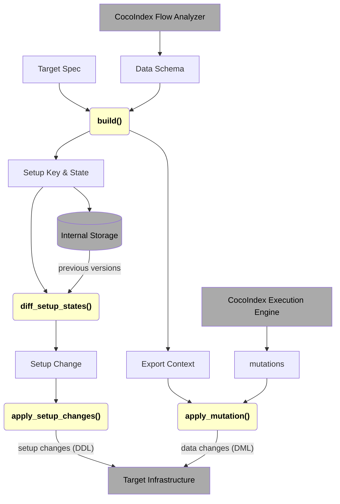

import Tabs from '@theme/Tabs';
import TabItem from '@theme/TabItem';

A target connects CocoIndex flow and external systems, and needs to synchronize changes of data from the CocoIndex flow to outside.

## Built-in Targets and Custom Targets

CocoIndex allows you to create [custom targets](/docs/custom_ops/custom_targets) by Python SDK.
Custom targets share the gist as built-in targets, but the interface is simplified, so it only supports a subset of capabilities.
The most notable difference is that custom target API exposed by Python SDK doesn't provide schema of the data to be exported, so it only fits most of the use cases where the target schema is fixed.
But the built-in targets get the schema, so it can be used to define general-purpose targets.

You're recommended to read the [custom target documentation](/docs/custom_ops/custom_targets) first as a starting point.

## Life of a Built-in Target

The core logic of a built-in target is the *Target Connector*, which is an implementation of the trait [`TargetFactoryBase`](https://github.com/search?q=repo%3Acocoindex-io%2Fcocoindex%20%22trait%20TargetFactoryBase%22&type=code).

*Users* provide a *Target Spec* when they export specific data (in the form of [Data Collector](/docs/core/flow_def#data-collector)) to the target.

### States / Contexts Building

*CocoIndex* analyzes the flow before execution. For each target, it will have the information of *Data Schema* exported to the target, and the *Target Spec*.
The *Target Connector* (an implementation of `TargetFactoryBase`) takes them by the `build()` method, to digest this information and return necessary information for setup changes and data changes, including a *Setup Key*, a *Setup State* and a *Export Context* for each target.

*Setup Key* and *Setup State* provides information to decide how to setup the target.
Both *Setup Key* and *Setup State* are persisted in CocoIndex's [internal storage](/docs/core/basics#internal-storage), to keep track of targets' states.

-   *Setup Key* is a key used to uniquely identify the target. It should remain stable across different calls.
    If it changes, CocoIndex considers it as a different target.
    For example, for Postgres, we use the table name as the setup key.

-   *Setup State* is a state of the target.
    *Setup Key* and *Setup State* should contain sufficient information to decide how to setup the target.
    For example, for Postgres, we use the table name and its schema as the setup state.

    :::note

    Note that different CocoIndex data types may be projected to the same column type in Postgres, e.g. all _Struct_ and _Table_ types are projected to `jsonb`.
    It's sufficient to keep `jsonb` instead of the specific CocoIndex type in *Setup State*, so the *Setup State* doesn't need to be changed too often.

    For historical reasons, we already put the specific CocoIndex type in *Setup State* for Postgres targets, and it's not easy to update it with a smooth migration, so we keep it for now.
    But for new targets, it's recommended to keep just sufficient information to define the target.

    :::

*Export Context* is an in-memory object that contains necessary information and objects to apply data changes.
For example, it may hold a database connection pool, or a prepared statement for upserting/deleting data, etc.

### Apply Setup Changes

*CocoIndex* calls the *Target Connector* (`diff_setup_states()`) to compare the current *Setup State* with previous ones, which returns *Setup Change* object to describe the change (or no change).
For example, for Postgres, the *Setup Change* object contains information such as which table needs to be created/dropped, which column needs to be added/dropped, etc.

*CocoIndex* further passes the *Setup Change* to the *Target Connector* (`apply_setup_changes()`), which is responsible for applying the *Setup Change* to the target infrastructure.
Here's the place for the target connector to issue the actual commands to setup, drop or update the target infrastructure.

:::note

Here CocoIndex may pass multiple versions of possible existing states to the target connector via `diff_setup_states()`. This is because there may be failures or interrupts in the previous setup attempts, so CocoIndex doesn't always clearly know the exact state of the target. CocoIndex needs to keep multiple versions of states on track (the existing one and the pending ones) until the next `apply_setup_changes()` is successful.

For example, consider the following scenarios:

-   A Postgres target's initial state describes it has a column `col_1`.
-   Later, after the flow changes, a new column `col_2` is collected, so a new version of target state has columns `col_1` and `col_2`. But the attempt to apply this setup change doesn't go through (e.g. connection to the database is broken, in general CocoIndex doesn't know the exact state the backend ends up with).
-   Now the user updates the column name from `col_2` to `col_3` in their flow. In the next attempt to apply the setup change, we get a setup state with `col_1` and `col_3`.

    -   To apply setup changes for the latest, CocoIndex will pass two versions existing setup states to the target connector via `diff_setup_states()`, one with `col_1`, the other with `col_1` and `col_2`. The new setup state has `col_1` and `col_3`. And the target connector needs to create a setup change that take both of the possible existing states into account. The change should be "drop `col_2` and add `col_3`".
    -   When applying the setup change in `apply_setup_changes()`, the target connector should do this idempotently, i.e. it should be a no-op if the column `col_2` already doesn't exist (by `DROP IF EXISTS`), so it works well on either possible existing state.
    -   After this setup change is applied successfully, CocoIndex clearly knows the target's current state (i.e. with columns `col_1` and `col_3`), and safely forgets all previous states.

:::

### Apply Data Changes

*CocoIndex* calls the *Target Connector* (`apply_mutation()`) to apply data changes, by list of mutations (upserts and deletes) together with their *Export Context*.
The method should apply these mutations in an idempotent way, i.e. it should be a no-op if the mutation is already applied.
For example, for Postgres, upserts are done by `INSERT ... ON CONFLICT ... DO UPDATE SET ...`, and deletes are done by `DELETE ... WHERE ...`.

### Notes on Multiple Targets

The interface of multiple methods in `TargetFactoryBase` (`build()`, `apply_setup_changes()`, `apply_mutation()`) takes a batch of inputs coming from multiple targets of the same type. This gives a chance for the connector to handle dependencies between them (if any) and apply changes in the correct order.
For example, to support property graph databases, relationships depend on nodes, so nodes need to be added before relationships, and on deletion it happens in reverse order.
This is not a consideration for target types that different targets are independent of each other.

## Examples

The following target implementations provide good examples:

-   [Postgres](/docs/ops/targets#postgres), see [related code](https://github.com/search?q=repo%3Acocoindex-io%2Fcocoindex+path%3A%2Ftarget%2F+Postgres&type=code).
    It provides a good example for targets with specific column types in the schema.

-   [Qdrant](/docs/ops/targets#qdrant), see [related code](https://github.com/search?q=repo%3Acocoindex-io%2Fcocoindex+path%3A%2Ftarget%2F+Qdrant&type=code).
    It provides a good example for targets without specific column types in the schema, as Qdrant's payloads are JSON objects.
