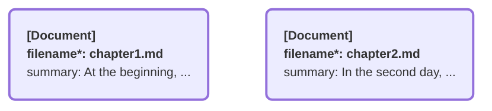
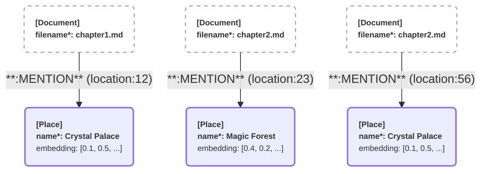
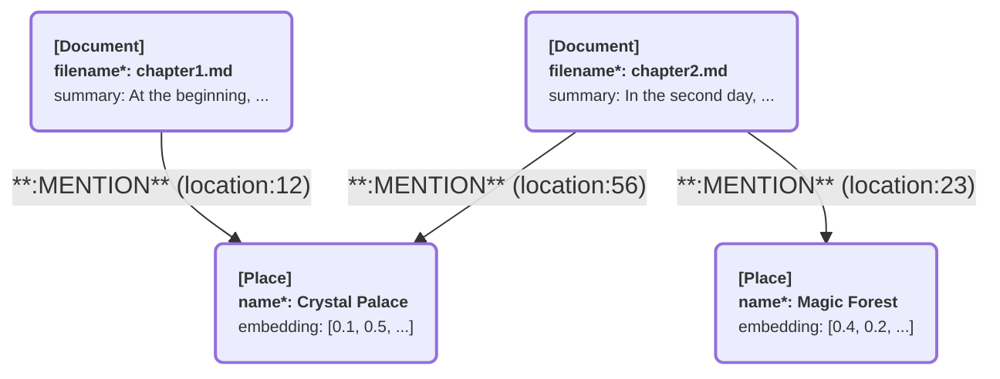

import { ExampleButton } from '../../src/components/GitHubButton';

# CocoIndex Built-in Targets

For each target, data are exported from a data collector, containing data of multiple entries, each with multiple fields.
The way to map data from a data collector to a target depends on data model of the target.

## Targets Overview

| Target Type    | Description                   |
|------------------|-------------------------|
| [Postgres](/docs/targets/postgres) | Relational Database, Vector Search (PGVector)   |
| [Qdrant](/docs/targets/qdrant)     | Vector Database, Keyword Search       |
| [LanceDB](/docs/targets/lancedb)   | Vector Database, Keyword Search         |
| [Neo4j](/docs/targets/neo4j)       | [Property graph](#property-graph-targets)        |
| [Kuzu](/docs/targets/kuzu)         | [Property graph](#property-graph-targets)        |

If you are looking for targets beyond here, you can always use [custom targets](/docs/custom_ops/custom_targets) as building blocks.


## Property Graph Targets
Property graph is a widely-adopted model for knowledge graphs, where both nodes and relationships can have properties.

[Graph database concepts](https://neo4j.com/docs/getting-started/appendix/graphdb-concepts/) has a good introduction to basic concepts of property graphs.

The following concepts will be used in the following sections:
* [Node](https://neo4j.com/docs/getting-started/appendix/graphdb-concepts/#graphdb-node)
    * [Node label](https://neo4j.com/docs/getting-started/appendix/graphdb-concepts/#graphdb-labels), which represents a type of nodes.
* [Relationship](https://neo4j.com/docs/getting-started/appendix/graphdb-concepts/#graphdb-relationship), which describes a connection between two nodes.
    * [Relationship type](https://neo4j.com/docs/getting-started/appendix/graphdb-concepts/#graphdb-relationship-type)
* [Properties](https://neo4j.com/docs/getting-started/appendix/graphdb-concepts/#graphdb-properties), which are key-value pairs associated with nodes and relationships.

### Data Mapping

Data from collectors are mapped to graph elements in various types:

1.  Rows from collectors → Nodes in the graph
2.  Rows from collectors → Relationships in the graph (including source and target nodes of the relationship)

This is what you need to provide to define these mappings:

*   Specify [nodes to export](#nodes-to-export).
*   [Declare extra node labels](#declare-extra-node-labels), for labels to appear as source/target nodes of relationships but not exported as nodes.
*   Specify [relationships to export](#relationships-to-export).

In addition, the same node may appear multiple times, from exported nodes and various relationships.
They should appear as the same node in the target graph database.
CocoIndex automatically [matches and deduplicates nodes](#nodes-matching-and-deduplicating) based on their primary key values.

### Nodes to Export

Here's how CocoIndex data elements map to nodes in the graph:

| CocoIndex Element | Graph Element |
|-------------------|------------------|
| an export target  | nodes with a unique label |
| a collected row   | a node |
| a field           | a property of node |

Note that the label used in different `Nodes`s should be unique.

`cocoindex.targets.Nodes` is to describe mapping to nodes. It has the following fields:

*   `label` (`str`): The label of the node.

For example, consider we have collected the following rows:

<small>

| filename | summary |
|----------|---------|
| chapter1.md | At the beginning, ... |
| chapter2.md | In the second day, ... |

</small>

We can export them to nodes under label `Document` like this:

```python
document_collector.export(
    ...
    cocoindex.targets.Neo4j(
        ...
        mapping=cocoindex.targets.Nodes(label="Document"),
    ),
    primary_key_fields=["filename"],
)
```

The collected rows will be mapped to nodes in knowledge database like this:



### Declare Extra Node Labels

If a node label needs to appear as source or target of a relationship, but not exported as a node, you need to [declare](/docs/core/flow_def#target-declarations) the label with necessary configuration.

The dataclass to describe the declaration is specific to each target (e.g. `cocoindex.targets.Neo4jDeclarations`),
while they share the following common fields:

*   `nodes_label` (required): The label of the node.
*   Options for [storage indexes](/docs/core/flow_def#storage-indexes).
    *   `primary_key_fields` (required)
    *   `vector_indexes` (optional)

Continuing the same example above.
Considering we want to extract relationships from `Document` to `Place` later (i.e. a document mentions a place), but the `Place` label isn't exported as a node, we need to declare it:

```python
flow_builder.declare(
    cocoindex.targets.Neo4jDeclarations(
        connection = ...,
        nodes_label="Place",
        primary_key_fields=["name"],
    ),
)
```

### Relationships to Export

Here's how CocoIndex data elements map to relationships in the graph:

| CocoIndex Element | Graph Element |
|-------------------|------------------|
| an export target  | relationships with a unique type |
| a collected row   | a relationship |
| a field           | a property of relationship, or a property of source/target node, based on configuration |

Note that the type used in different `Relationships`s should be unique.

`cocoindex.targets.Relationships` is to describe mapping to relationships. It has the following fields:

*   `rel_type` (`str`): The type of the relationship.
*   `source`/`target` (`cocoindex.targets.NodeFromFields`): Specify how to extract source/target node information from specific fields in the collected row. It has the following fields:
    *   `label` (`str`): The label of the node.
    *   `fields` (`Sequence[cocoindex.targets.TargetFieldMapping]`): Specify field mappings from the collected rows to node properties, with the following fields:
        *   `source` (`str`): The name of the field in the collected row.
        *   `target` (`str`, optional): The name of the field to use as the node field. If unspecified, will use the same as `source`.

        :::note Map necessary fields for nodes of relationships

        You need to map the following fields for nodes of each relationship:

        *   Make sure all primary key fields for the label are mapped.
        *   Optionally, you can also map non-key fields. If you do so, please make sure all value fields are mapped.

        :::

All fields in the collector that are not used in mappings for source or target node fields will be mapped to relationship properties.

For example, consider we have collected the following rows, to describe places mentioned in each file, along with embeddings of the places:

<small>

| doc_filename | place_name | place_embedding | location |
|----------|-------|-----------------|-----------------|
| chapter1.md | Crystal Palace | [0.1, 0.5, ...] | 12 |
| chapter2.md | Magic Forest | [0.4, 0.2, ...] | 23 |
| chapter2.md | Crystal Palace | [0.1, 0.5, ...] | 56 |

</small>

We can export them to relationships under type `MENTION` like this:

```python
doc_place_collector.export(
    ...
    cocoindex.targets.Neo4j(
        ...
        mapping=cocoindex.targets.Relationships(
            rel_type="MENTION",
            source=cocoindex.targets.NodeFromFields(
                label="Document",
                fields=[cocoindex.targets.TargetFieldMapping(source="doc_filename", target="filename")],
            ),
            target=cocoindex.targets.NodeFromFields(
                label="Place",
                fields=[
                    cocoindex.targets.TargetFieldMapping(source="place_name", target="name"),
                    cocoindex.targets.TargetFieldMapping(source="place_embedding", target="embedding"),
                ],
            ),
        ),
    ),
    ...
)
```

The `doc_filename` field is mapped to `Document.filename` property for the source node, while `place_name` and `place_embedding` are mapped to `Place.name` and `Place.embedding` properties for the target node.
The remaining field `location` becomes a property of the relationship.
For the data above, we get a bunch of relationships like this:



### Nodes Matching and Deduplicating

The nodes and relationships we got above are discrete elements.
To fit them into a connected property graph, CocoIndex will match and deduplicate nodes automatically:

*   Match nodes based on their primary key values. Nodes with the same primary key values are considered as the same node.
*   For non-primary key fields (a.k.a. value fields), CocoIndex will pick the values from an arbitrary one.
    If multiple nodes (before deduplication) with the same primary key provide value fields, an arbitrary one will be picked.

:::note

The best practice is to make the value fields consistent across different appearances of the same node, to avoid non-determinism in the exported graph.

:::

After matching and deduplication, we get the final graph:



### Examples

You can find end-to-end examples fitting into any of supported property graphs in the following directories:
*   <ExampleButton href="https://github.com/cocoindex-io/cocoindex/tree/main/examples/docs_to_knowledge_graph" text="Docs to Knowledge Graph" margin="0 0 16px 0" />

*   <ExampleButton href="https://github.com/cocoindex-io/cocoindex/tree/main/examples/product_recommendation" text="Product Recommendation" margin="0 0 16px 0" />


